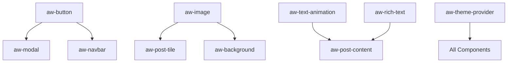

# Component Inventory & Analysis

## 📊 Component Breakdown by Category

### Navigation Components (15 total)
| Current Component | New Component | Priority | Complexity | Notes |
|------------------|---------------|----------|------------|-------|
| `navigation/logo.js` | `aw-logo` | High | Low | Simple branding component |
| `navigation/primary-navigation.js` | `aw-nav` | High | Medium | Core navigation logic |
| `navigation/menu.js` | `aw-menu` | High | Medium | Dropdown/mobile menu |
| `navigation/navbar-awwwards.js` | `aw-navbar` (variant) | High | High | Consolidate 4 variants |
| `navigation/navbar-awwwards2.js` | `aw-navbar` (variant) | High | High | " |
| `navigation/navbar-awwwards-glass.js` | `aw-navbar` (variant) | High | High | " |
| `navigation/navbar-applause.js` | `aw-navbar` (variant) | High | High | " |
| `navigation/navbar-applause-main.js` | `aw-navbar` (variant) | High | High | " |
| `navigation/page-nav.js` | `aw-page-nav` | Medium | Medium | Page-specific navigation |
| `navigation/audio.js` | `aw-audio-controls` | Low | Medium | Audio player controls |
| `navigation/chrome.js` | `aw-browser-chrome` | Low | Low | Browser chrome simulation |
| `navigation/logotype.js` | `aw-logotype` | Medium | Low | Extended logo component |
| `navigation/audio-utils.js` | Utility | Low | Low | Convert to utility function |
| `navigation/navigation-preview.util.js` | Utility | Low | Low | Preview utility |

### Motion/Animation Components (25 total)
| Current Component | New Component | Priority | Complexity | Notes |
|------------------|---------------|----------|------------|-------|
| `motion/text-anim-*.js` (15 variants) | `aw-text-animation` | High | High | Consolidate into one component with variants |
| `motion/animated-element.js` | `aw-animated-element` | High | Medium | Generic animation wrapper |
| `motion/paralax-element.js` | `aw-parallax` | Medium | Medium | Scroll-based parallax |
| `motion/text-rotating.js` | `aw-text-rotation` | Medium | Medium | Text rotation effects |
| `motion/text-scamble.js` | `aw-text-scramble` | Low | Medium | Text scramble animation |
| `motion/text-italic.js` | `aw-text-italic` | Low | Low | Italic text animation |
| `motion/animated-text.js` | Part of `aw-text-animation` | High | Medium | Merge with main text animation |
| `motion/scale-container.js` | `aw-scale-container` | Medium | Low | Scale animation wrapper |
| `motion/clippath-*.js` | `aw-clippath-animation` | Medium | Medium | Clip path animations |

### Base/UI Components (12 total)
| Current Component | New Component | Priority | Complexity | Notes |
|------------------|---------------|----------|------------|-------|
| `base/button/*.js` (5 variants) | `aw-button` | High | Medium | Consolidate button variants |
| `base/form/*.js` (8 components) | `aw-input`, `aw-select`, etc. | High | Medium | Form component suite |
| `base/modal.js` | `aw-modal` | High | Medium | Modal dialog component |
| `base/close.js` | `aw-close-button` | High | Low | Close button component |
| `base/ctx-menu.js` | `aw-context-menu` | Medium | Medium | Context menu component |
| `base/theme-modal.js` | `aw-theme-modal` | Low | Medium | Theme selection modal |
| `base/theme-trigger/index.js` | `aw-theme-trigger` | Low | Low | Theme toggle button |
| `base/glass/*.tsx` | `aw-glass-element` | Medium | High | Glass effect component |

### Image Components (8 total)
| Current Component | New Component | Priority | Complexity | Notes |
|------------------|---------------|----------|------------|-------|
| `image/contentful-image.js` | `aw-contentful-image` | High | High | Contentful CMS integration |
| `image/content-image.js` | `aw-content-image` | High | Medium | General content images |
| `image/cover-image.js` | `aw-cover-image` | High | Medium | Cover/hero images |
| `image/blend-image.js` | `aw-blend-image` | Medium | High | Image blending effects |
| `image/blend-image-fill.js` | Part of `aw-blend-image` | Medium | High | Merge with blend-image |
| `image/textured-image.js` | `aw-textured-image` | Medium | Medium | Textured image effects |
| `image/image-modal.js` | `aw-image-modal` | Medium | Medium | Image lightbox modal |

### Block Components (15 total)
| Current Component | New Component | Priority | Complexity | Notes |
|------------------|---------------|----------|------------|-------|
| `blocks/block-*.js` (13 variants) | `aw-block-*` series | Medium | Medium | Content block system |
| `blocks/block_preview.js` | `aw-block-preview` | Low | Low | Preview utility |
| `blocks/block_preview_grid.js` | `aw-block-grid` | Medium | Medium | Block grid layout |

### Post/Content Components (12 total)
| Current Component | New Component | Priority | Complexity | Notes |
|------------------|---------------|----------|------------|-------|
| `post/post-*.js` (10 variants) | `aw-post-*` series | Medium | Medium | Post display components |
| `post/post-modal.js` | `aw-post-modal` | Medium | Medium | Post detail modal |
| `rich-text/*.js` (3 variants) | `aw-rich-text` | High | High | Rich text rendering |

### Background Components (10 total)
| Current Component | New Component | Priority | Complexity | Notes |
|------------------|---------------|----------|------------|-------|
| `background/background-*.js` (4 variants) | `aw-background` | Medium | Medium | Background effects |
| `background/canvas*.js` (4 variants) | `aw-canvas-background` | Medium | High | Canvas-based backgrounds |
| `background/experience.js` | `aw-webgl-background` | Low | Very High | WebGL background effects |
| `background/texture-container.js` | `aw-texture-container` | Medium | Medium | Texture overlay system |

### Transition Components (8 total)
| Current Component | New Component | Priority | Complexity | Notes |
|------------------|---------------|----------|------------|-------|
| `transition/*.js` (7 variants) | `aw-page-transition` | Medium | High | Page transition system |
| `transition/pageTransition.js` | Part of `aw-page-transition` | Medium | High | Main transition logic |

### Cursor Components (4 total)
| Current Component | New Component | Priority | Complexity | Notes |
|------------------|---------------|----------|------------|-------|
| `cursor/*.js` (4 variants) | `aw-cursor` | Low | Medium | Custom cursor effects |

### Tile Components (10 total)
| Current Component | New Component | Priority | Complexity | Notes |
|------------------|---------------|----------|------------|-------|
| `tile/post-tile-*.js` (9 variants) | `aw-post-tile` | Medium | Medium | Post tile variations |
| `tile/tile-preview.util.js` | Utility | Low | Low | Preview utility |

### Article List Components (8 total)
| Current Component | New Component | Priority | Complexity | Notes |
|------------------|---------------|----------|------------|-------|
| `articleList/*.js` (7 variants) | `aw-article-list` | Medium | Medium | Article listing variations |

### Utility Components (20 total)
| Current Component | New Component | Priority | Complexity | Notes |
|------------------|---------------|----------|------------|-------|
| `utils/*.js` (20 utilities) | Various utilities | Low | Low-Medium | Convert to utility functions |

### Context Components (8 total)
| Current Component | New Component | Priority | Complexity | Notes |
|------------------|---------------|----------|------------|-------|
| `context/*.js` (8 contexts) | Event-based system | Medium | High | Replace with custom events |

### Security Components (3 total)
| Current Component | New Component | Priority | Complexity | Notes |
|------------------|---------------|----------|------------|-------|
| `security/*.js` (3 components) | `aw-auth-*` series | Low | Medium | Authentication components |

## 📈 Migration Complexity Analysis

### Consolidation Opportunities
1. **Navbar Components** (5) → `aw-navbar` with variants (-4 components)
2. **Text Animation** (15) → `aw-text-animation` with modes (-14 components)
3. **Button Components** (5) → `aw-button` with variants (-4 components)
4. **Background Components** (4) → `aw-background` with types (-3 components)
5. **Post Tile Components** (9) → `aw-post-tile` with variants (-8 components)

**Total Reduction**: ~33 components through consolidation

### Component Dependencies

### Critical Path Components
1. **aw-button** - Used by 15+ other components
2. **aw-image** - Used by 10+ other components  
3. **aw-text-animation** - Used by 8+ other components
4. **aw-theme-provider** - Used by all components
5. **aw-modal** - Used by 6+ other components

## 🎯 Component Priority Matrix

### Phase 1 (Weeks 1-3) - Foundation
- ✅ `aw-button` (High Impact, Medium Effort)
- ✅ `aw-input` (High Impact, Medium Effort)
- ✅ `aw-modal` (High Impact, Medium Effort)
- ✅ `aw-theme-provider` (High Impact, High Effort)

### Phase 2 (Weeks 4-5) - Navigation
- ✅ `aw-logo` (High Impact, Low Effort)
- ✅ `aw-navbar` (High Impact, High Effort)
- ✅ `aw-nav` (High Impact, Medium Effort)

### Phase 3 (Weeks 6-8) - Animation
- ✅ `aw-text-animation` (Medium Impact, High Effort)
- ✅ `aw-animated-element` (Medium Impact, Medium Effort)
- ✅ `aw-parallax` (Low Impact, Medium Effort)

### Phase 4 (Weeks 7-9) - Media
- ✅ `aw-image` (High Impact, Medium Effort)
- ✅ `aw-contentful-image` (High Impact, High Effort)
- ✅ `aw-background` (Medium Impact, High Effort)

### Phase 5 (Weeks 10-11) - Content
- ✅ `aw-rich-text` (High Impact, High Effort)
- ✅ `aw-post-tile` (Medium Impact, Medium Effort)
- ✅ `aw-article-list` (Medium Impact, Medium Effort)

## 📊 Effort Estimation

### Total Estimated Effort: 60-70 person-days

| Component Category | Components | Effort (days) | Notes |
|-------------------|------------|---------------|-------|
| Foundation Setup | - | 3-5 | Initial project setup |
| Base Components | 8 | 8-10 | Core UI components |
| Navigation | 6 | 10-12 | Complex state management |
| Animation | 12 | 15-18 | Performance optimization |
| Media/Images | 8 | 12-15 | CMS integration complexity |
| Content/Blocks | 15 | 10-12 | Template rendering |
| Testing & Docs | - | 8-10 | Quality assurance |
| Polish & Release | - | 3-5 | Final optimization |

## 🔄 Migration Dependencies

### Blocker Dependencies
- `aw-theme-provider` must be complete before all other components
- `aw-button` required for `aw-modal`, `aw-navbar`
- `aw-image` required for content components
- Animation utilities needed before motion components

### Parallel Development Opportunities
- Base form components can be developed in parallel
- Image and animation components are independent
- Content components can be developed after base components
- Documentation can be written alongside development

---

*This inventory will be updated as migration progresses and requirements evolve.*